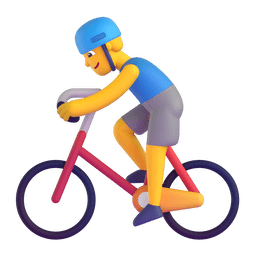
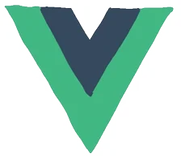



[;Hi%2C%20I%27m%20Lok%20%F0%9F%91%8B;AI%20Agent%20%26%20Web%20full%20stack%20developer;Learning%20Agent%20Development&center=true&size=27)](https://git.io/typing-svg)

<picture>
  <source media="(prefers-color-scheme: dark)" srcset="assets/images/coding.gif" />
  <source media="(prefers-color-scheme: light)" srcset="assets/images/developer.svg" height="225px" />
  
</picture>

&nbsp;

  &emsp;
  &emsp;
  &emsp;
  <!-- visitor -->
  &emsp;
  <!-- wakatime -->
  

<picture>
  <source media="(prefers-color-scheme: dark)" srcset="https://cdn.jsdelivr.net/gh/Topskys/Topskys/profile-snake-contrib/github-contribution-grid-snake-dark.svg" />
  <source media="(prefers-color-scheme: light)" srcset="https://cdn.jsdelivr.net/gh/Topskys/Topskys/profile-snake-contrib/github-contribution-grid-snake.svg" />
  
</picture>

# 🙋 Hello

<table>

<tr><td>

### 🤺 About Me

&emsp;&emsp;Hi, I'm <b>Lok</b> — an <b>AI Agent</b> and <b>Web full stack developer</b>.

&emsp;&emsp;Passionate about building complete web apps from 0 to 1. Currently diving deep into <b>AI Agent development</b>.

&emsp;&emsp;<strong>We're making the world a better place. Through constructing elegant hierarchies for maximum code reuse and extensibility.</strong>

</tr></td>

<tr><td>

### 📃 Recent Blog

<!-- feed start -->
- Apr 05 - [封装数字滚动动画函数](https://blog.csdn.net/qq_58062502/article/details/159856167)
- Apr 05 - [利用自定义Ref实现防抖](https://blog.csdn.net/qq_58062502/article/details/159855660)
- Dec 15 - [CommonJS 的工作原理是什么](https://blog.csdn.net/qq_58062502/article/details/155893021)
- Dec 13 - [ESModule的工作原理是什么](https://blog.csdn.net/qq_58062502/article/details/155892650)
- Nov 02 - [多行文本擦除效果](https://blog.csdn.net/qq_58062502/article/details/153529321)
<!-- feed end -->

</td></tr>

<tr><td>

### 📊 WakaTime

<!--START_SECTION:waka-->
<!--END_SECTION:waka-->

</td></tr>

</table>

  <picture>
    <source media="(prefers-color-scheme: dark)" srcset="https://readme-jokes.vercel.app/api?hideBorder&bgColor=%23121212" />
    <source media="(prefers-color-scheme: light)" srcset="https://readme-jokes.vercel.app/api?hideBorder&bgColor=%ffffff" />
    
  </picture>

<picture>
  <source media="(prefers-color-scheme: dark)" srcset="https://github-readme-streak-stats.demolab.com/?user=Topskys&theme=dark&hide_border=true" />
  <source media="(prefers-color-scheme: light)" srcset="https://github-readme-streak-stats.demolab.com/?user=Topskys&theme=light&hide_border=true" />
  
</picture>

<table>
  <tr>
    <td>
      <picture>
        <source media="(prefers-color-scheme: dark)" srcset="https://github-readme-activity-graph.vercel.app/graph?username=Topskys&theme=xcode&bg_color=FF000000&hide_border=true" />
        <source media="(prefers-color-scheme: light)" srcset="https://github-readme-activity-graph.vercel.app/graph?username=Topskys&theme=github-light&hide_border=true" />
        
      </picture>
  </tr>
</table>

 

 

<!-- svg -->

 

<!-- gif -->

<picture>
  <source media="(prefers-color-scheme: dark)" srcset="https://cdn.jsdelivr.net/gh/Topskys/Topskys/profile-3d-contrib/profile-night-green.svg" />
  <source media="(prefers-color-scheme: light)" srcset="https://cdn.jsdelivr.net/gh/Topskys/Topskys/profile-3d-contrib/profile-gitblock.svg" />
  
</picture>

<table>
  <tr>
    <td></td>
  </tr>
</table>

<table>
  <tr>
    <td></td>
    <td></td>
  </tr>
  <tr>
    <td></td>
    <td></td>
  </tr>
  <tr>
    <td></td>
  </tr>
  <tr>
    <td></td>
    <td></td>
  </tr>
  <tr>
    <td></td>
    <td></td>
  </tr>
</table>

